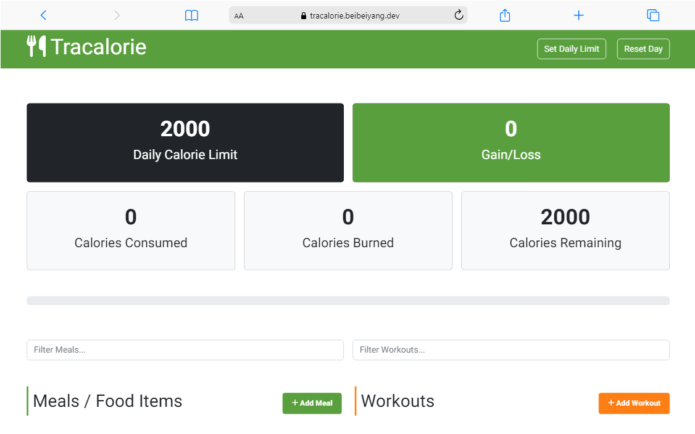

# Calories Tracker

## Overview
This is a simple calorie counter application developed using vanilla JavaScript with an object-oriented programming approach and bundled with Webpack. It allows you to track your meals and workouts, calculating the total calories consumed and burned.

## Built With
This project is built with HTML, CSS, Javascript, Webpack.
- HTML
- CSS
- Javascript
- Webpack

## Live Demo

Check out the live site [Tracalorie](https://tracalorie.beibeiyang.dev/).

## Features
- Displays the tracker status
- Allows saving and removing meals and workouts to/from local storage
- Persists total calories in local storage
- Displays a progress bar and calorie alert
- Enables filtering of meals and workouts
- Provides an option to reset the daily calorie limit

## License
See LICENSE.md for more information.

## Contact
- Beibei Yang [beibeiyang88@hotmail.com](mailto:beibeiyang88@hotmail.com)
